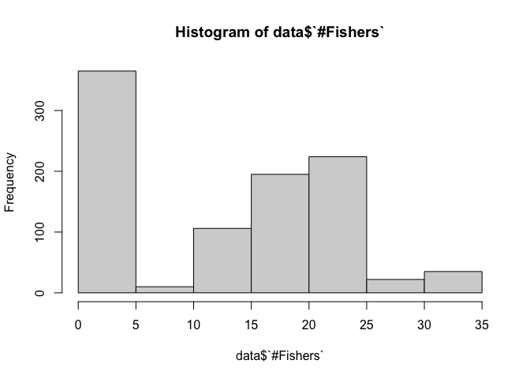
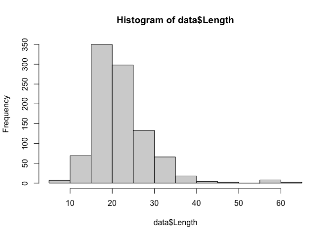
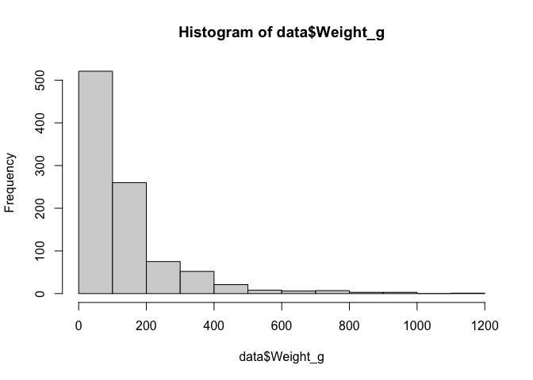
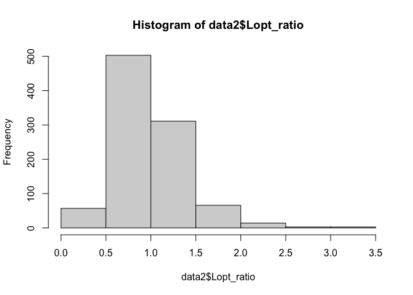
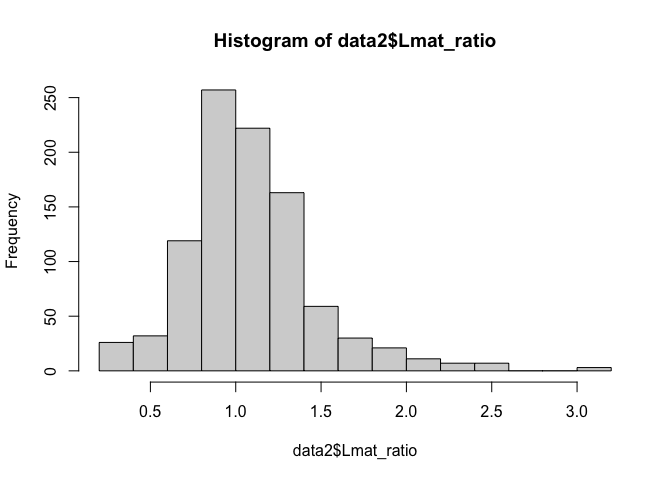
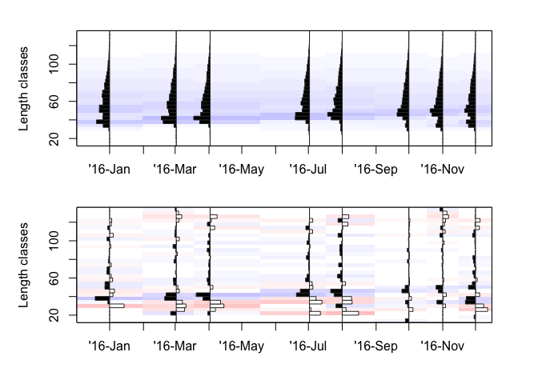
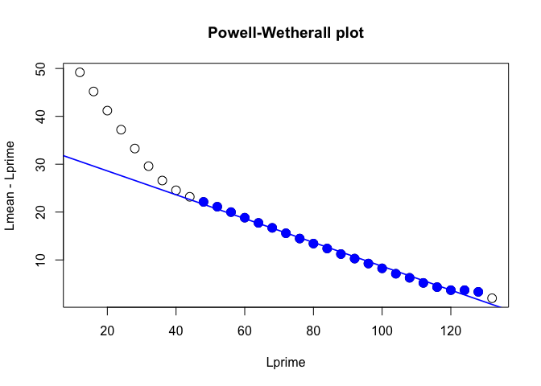

WCS USAID Project Analysis
================
Author: Emma Strand; <https://linktr.ee/emmastrand>

## <a name="libraries"></a> **Load all libraries**

``` r
library(plyr)
library(dplyr)
library(tidyverse)
library(ggplot2)
library(readxl)
library(lubridate)
library(Hmisc)
library(writexl)
library(naniar)
```

# Quality Control

## Import dataset

The google drive version shared via WCS USAID google drive folder has
several errors with month, fishing gear type, and hidden formatting in
excel. For any future analyses, I recommend using the
`LengthData_20230712_EScleaned` excel sheet produced from this script.

``` r
## when running future iterations of raw data file, replace the file name below 
data <- read_excel("data/LengthData_20230712.xlsx", sheet = "Clean_data",
                                col_types = c("date", "text", "text", "text", "text", 
                                              "text", "text", "numeric", "numeric", "text",
                                              "text", "numeric", "numeric", "numeric")) %>%
  dplyr::rename(Weight_kg = `Weight(Kg)`) %>% dplyr::rename(Weight_g = `Weight( Grams`)

nrow(data) ## 957 20230712 download from google drive 
```

    ## [1] 957

### Cleaning dataset

**Month and Year**

``` r
#unique(data$Month) 
## "Sept"      "September" "Oct"       "October"   "August"    "November" 

## changing all Sept and Oct entries to read September and October 
## $ indicates end of a phrase; otherwise all 'Sept' in 'September' would also be changed 
data <- data %>%
  mutate(Month = gsub("Sept$", "September", Month),
         Month = gsub("Oct$", "October", Month))

unique(data$Month) 
```

    ## [1] "September" "October"   "August"    "November"

``` r
## end result 
# "September" "October"   "August"    "November" 

unique(data$Year) ## all 2022 
```

    ## [1] "2022"

**Landing site**

``` r
unique(data$`Landing Site`)
```

    ## [1] "Vanga"    "Shimoni"  "Mkwiro"   "Kibuyuni" "Wasini"

**Date Collector**

``` r
unique(data$`Data Collector`)
```

    ## [1] "Sofia Saidi"     "Roselyne Mwakio" "Roselyn Mwakio"

**Group**

``` r
unique(data$Group)
```

    ## [1] "1" "4" "2" "3" "5" "6" "7" "8"

**Fishing Gear**

``` r
data <- data %>%
  mutate(Fishgear = gsub("SG/HS", "HS/SG", Fishgear),
         Fishgear = gsub("ringnet", "Ring net", Fishgear),
         Fishgear = gsub("reefseine", "Reef seine", Fishgear),
         Fishgear = gsub("Reefseine", "Reef seine", Fishgear),
         Fishgear = gsub("Ringnet", "Ring net", Fishgear),
         Fishgear = gsub("Reef net", "Reef Net", Fishgear),
         Fishgear = gsub("speargun", "Speargun", Fishgear),
         Fishgear = gsub("reefsen", "Reef seine", Fishgear),
         Fishgear = gsub("Handline", "Hand line", Fishgear),
         Fishgear = gsub("monofilament", "Monofilament", Fishgear))

unique(data$Fishgear)
```

    ##  [1] "Reef seine"        "Speargun"          "HS/SG"            
    ##  [4] "Malema"            "Basket trap"       "Ring net"         
    ##  [7] "Traps"             "Hand line"         "Gillnet"          
    ## [10] "Reef Net"          "Traps & handlines" "Monofilament"

**\# Boats and Fishers**

``` r
range(data$`# Boats`) ##0-2
```

    ## [1] 0 2

``` r
hist(data$`#Fishers`) ##1-35
```

<!-- -->

``` r
hist(data$Length) ## 7.6 - 61.5 
```

<!-- -->

``` r
hist(data$Weight_kg) ## 0 - 1.113
```

<!-- -->

``` r
data <- data %>%
  ## changing all NA's to zero in Weight_g column 
  mutate(Weight_g = coalesce(Weight_g, 0)) 

hist(data$Weight_g) ## 0 - 1113 
```

<!-- --> **Fish
ID**

``` r
unique(data$Family)
```

    ##  [1] "Acanthuridae"    "Apogonidae"      "Aulostomidae"    "Belonidae"      
    ##  [5] "Caesionidae"     "Carangidae"      "Chaetodontidae"  "Dasyatidae"     
    ##  [9] "Dorosomatidae"   "Engraulidae"     "Ephippidae"      "Epinephelidae"  
    ## [13] "Gerreidae"       "Haemulidae"      "Hemiramphidae"   "Holocentridae"  
    ## [17] "Labridae"        "Lethrinidae"     "Lutjanidae"      "Monodactylidae" 
    ## [21] "Mullidae"        "Nemipteridae"    "Platycephalidae" "Pomacentridae"  
    ## [25] "Priacanthidae"   "Scaridae"        "Scombridae"      "Serranidae"     
    ## [29] "Siganidae"       "Sillaginidae"    "Sphyraenidae"    "Synodontidae"   
    ## [33] "Terapontidae"

``` r
sort(unique(data$Species))
```

    ##   [1] "Abudefduf vaigiensis"        "Acanthurus dussumieri"      
    ##   [3] "Acanthurus nigricauda"       "Alepes djedaba"             
    ##   [5] "Anampses caeruleopunctatus"  "Atule mate"                 
    ##   [7] "Aulostomus chinensis"        "Calotomus carolinus"        
    ##   [9] "Carangoides ciliarius"       "Carangoides gymnosthethus"  
    ##  [11] "Carangoides malabaricus"     "Cephalopholis boenak"       
    ##  [13] "Cephalopholis spiloparaea"   "Chaetodon auriga"           
    ##  [15] "Cheilinus trilobatus"        "Cheilio inermis"            
    ##  [17] "Cheilodipterus arabicus"     "Ctenochaetus striatus"      
    ##  [19] "Decapterus kurroides"        "Encrasicholina heteroloba"  
    ##  [21] "Epinephelus merra"           "Epinephelus rivulatus"      
    ##  [23] "Epinephelus spilotoceps"     "Epinephelus tauvina"        
    ##  [25] "Euthynnus affinis"           "Gerres longirostris"        
    ##  [27] "Gerres oblongus"             "Gerres oyena"               
    ##  [29] "Gomphosus caeruleus"         "Halichoeres hortulanus"     
    ##  [31] "Hemiramphus far"             "Hemiramphus marginatus"     
    ##  [33] "Hyporhamphus affinis"        "Hyporhamphus dussumieri"    
    ##  [35] "Leptoscarus vaigiensis"      "Lethrinus borbonicus"       
    ##  [37] "Lethrinus harak"             "Lethrinus lentjan"          
    ##  [39] "Lethrinus mahsena"           "Lethrinus microdon"         
    ##  [41] "Lethrinus nebulosus"         "Lethrinus obsoletus"        
    ##  [43] "Lethrinus olivaceus"         "Lethrinus rubrioperculatus" 
    ##  [45] "Lethrinus variegatus"        "Lutjanus argentimaculatus"  
    ##  [47] "Lutjanus fulviflamma"        "Lutjanus kasmira"           
    ##  [49] "Lutjanus lutjanus"           "Monodactylus argenteus"     
    ##  [51] "Monotaxis grandoculis"       "Mulloidichthys vanicolensis"
    ##  [53] "Myripristis berndti"         "Naso annulatus"             
    ##  [55] "Naso hexacanthus"            "Papilloculiceps longiceps"  
    ##  [57] "Parupeneus barberinus"       "Parupeneus cyclostomus"     
    ##  [59] "Parupeneus heptacanthus"     "Parupeneus indicus"         
    ##  [61] "Parupeneus macronemus"       "Platax teira"               
    ##  [63] "Plectorhinchus centurio"     "Plectorhinchus chubbi"      
    ##  [65] "Plectorhinchus gaterinus"    "Plectorhinchus schotaf"     
    ##  [67] "Plectorhinchus sordidus"     "Plectorhinchus vittatus"    
    ##  [69] "Priacanthus hamrur"          "Pterocaesio chrysozona"     
    ##  [71] "Rastrelliger kanagurta"      "Sardinella albella"         
    ##  [73] "Sardinella longiceps"        "Sardinella neglecta"        
    ##  [75] "Sargocentron caudimaculatum" "Sargocentron praslin"       
    ##  [77] "Saurida gracilis"            "Scarus ghobban"             
    ##  [79] "Scarus globiceps"            "Scarus psittacus"           
    ##  [81] "Scarus rubroviolaceus"       "Scolopsis bimaculata"       
    ##  [83] "Scolopsis ghanam"            "Scomberoides tol"           
    ##  [85] "Scomberomorus commerson"     "Siganus argenteus"          
    ##  [87] "Siganus canaliculatus"       "Siganus stellatus"          
    ##  [89] "Siganus sutor"               "Sillago sihama"             
    ##  [91] "Sphyraena barracuda"         "Sphyraena flavicauda"       
    ##  [93] "Sphyraena obtusata"          "Strongylura leiura"         
    ##  [95] "Taeniamia mozambiquensis"    "Taeniura lymma"             
    ##  [97] "Terapon jarbua"              "Tylosurus crocodilus"       
    ##  [99] "Upeneus margarethae"         "Upeneus saiab"              
    ## [101] "Upeneus sulphureus"          "Upeneus vittatus"

This dataset was pretty clean prior to me starting analyses!

Exporting my clean set

``` r
data %>% write_xlsx("data/LengthData_20230712_EScleaned.xlsx")
```

# Length based summary

Importing Galligan dataset from our Kenya project. Can also be found
here:
<https://github.com/emmastrand/Kenya_SamakiSalama/blob/main/FishLandings/data/SpeciesData_GatedTraps_Galligan_edited.csv>.

``` r
galligan <- read.csv('data/SpeciesData_GatedTraps_Galligan_expanded.csv', header=TRUE, sep = ",") %>%
  dplyr::select(-Family)
## 261 species included in the above sheet 

data2 <- left_join(data, galligan, by = c("Species"))  
nrow(data2) ## should be 957- this should be match the original number b/c we haven't removed any data 
```

    ## [1] 957

Checking for species not found in Galligan extended that were found in
the larger dataset:

``` r
data2 %>% filter(is.na(Lmat_cm)) %>% dplyr::select(Species) %>% distinct()
```

    ## # A tibble: 0 × 1
    ## # ℹ 1 variable: Species <chr>

``` r
## output should be zero 
```

## 1. Calculating L:Lopt and L:Lmat Ratios for each fish caught

``` r
data2 <- data2 %>%
  mutate(Lopt_ratio = Length/Lopt_cm,
         Lmat_ratio = Length/Lmat_cm)

## checking range and hist of each ratio 
hist(data2$Lopt_ratio) ## range = 0.2074522 3.5000000
```

<!-- -->

``` r
hist(data2$Lmat_ratio) ## range = 0.2672897 3.1111111
```

<!-- -->

## 2. Calculating Spawning Potential Ratio

### 2.1 Prepare dataframes

To use the package in step 2.2, we need each species to have a single
dataframe with only length values

``` r
#unique(data2$Species) ## 102 species ; 71 with > 3 observations 

sample_size <- data2 %>% 
  ## creating a dataframe for only length values 
  dplyr::select(Species, Length) %>% group_by(Species) %>%
  
  ## for those species with above a catch count of 3 
  mutate(sample_size = n()) %>% ungroup() 
  
sample_size %>% filter(!sample_size < 3) %>% dplyr::select(-sample_size) %>%
  ## for each Species, this function will export a csv
  group_by(Species) %>%
  group_walk(~ write_csv(.x, file = paste0("data/species/", .y$Species, ".csv")))
```


More info here: <https://edis.ifas.ufl.edu/publication/FA241>.

R package to do this:
<https://sfg-ucsb.github.io/fishery-manageR/wrapping-up.html> and
<https://cran.r-project.org/web/packages/LBSPR/vignettes/LBSPR.html>.

### 2.1 Install package

``` r
#install.packages("LBSPR")
#library(LBSPR)
```

### 2.2 Fitting Empirical Length Data

Length data is located in `data/species/` with 71 separate csv files.
The goal is to calculate SPR for each species using this empirical data.

``` r
# ## create new empty objects
# MyLengths <- new("LB_lengths")
# MyPars <- new("LB_pars")
# 
# ## list all potential parameters
# slotNames(MyLengths)
# slotNames(MyPars)
# 
# ## Fill MyPars 
# MyPars@Species <- "Acanthurus dussumieri"
# MyPars@Linf <- 30.04598 
# MyPars@L50 <- 15 
# MyPars@L95 <- 40
# MyPars@MK <- 1.5 
# MyPars@L_units <- "cm"
# 
# # loading folder of csv files 
# datdir <- "data/species/"
# list.files(datdir, pattern=".csv")
# 
# ## new length file
# Len1 <- new("LB_lengths", LB_pars=MyPars, 
#             file="data/species/Acanthurus dussumieri.csv", dataType="raw", header=TRUE)
# 
# 
# Shiny("LBSPR")
# Shiny("YPRSim")
```

# MSY

Estimate MSY using catch estimates based on the 5 landing sites.

1.  Evaluate this for 4 categories or levels: a.) the most abundant
    species, b.) the most abundant families, c.) fishable, d.) target
    catch.  
2.  

### 3.1 Calculate the most abundant species and families and create list.

``` r
abundant_species <- sample_size %>% dplyr::select(-Length) %>% distinct() %>%
  ## sort dataframe by the most to least abundant
  arrange(., desc(sample_size)) %>%
  ## selecting the top 10 rows (top 10 most abundant) 
  slice(., 1:10)

abundant_families <- data2 %>% 
  ## creating a dataframe for only length values 
  dplyr::select(Family, Length) %>% group_by(Family) %>%
  ## for those species with above a catch count of 3 
  mutate(sample_size = n()) %>% dplyr::select(-Length) %>% 
  distinct() %>% ungroup() %>%
  ## sort dataframe by the most to least abundant
  arrange(., desc(sample_size)) %>%
  ## selecting the top 10 rows (top 10 most abundant) 
  slice(1:10)
```

### 3.2 Downlaod TropFishR package

Resources:  
- <https://sfg-ucsb.github.io/fishery-manageR/wrapping-up.html>  
- <https://github.com/tokami/TropFishR>  
- <http://cran.nexr.com/web/packages/TropFishR/vignettes/tutorial.html>

#### 3.2.1 Installing and loading example data

``` r
# install.packages("remotes")
# remotes::install_github("tokami/TropFishR")
# install.packages(c('TropFishR','DLMTool', 'LBSPR', 'fishmethods'))

library(remotes)
library(Matrix) ##dependency of TropFishR 
```

    ## 
    ## Attaching package: 'Matrix'

    ## The following objects are masked from 'package:tidyr':
    ## 
    ##     expand, pack, unpack

``` r
library(TropFishR)
```

    ## 
    ## Attaching package: 'TropFishR'

    ## The following object is masked from 'package:dplyr':
    ## 
    ##     select

``` r
## use dplyr:: in front of select b/c TropFishR masks the 'select' fxn 

## load example data 
data("synLFQ7")
```

### 3.3 Biological stock characteristics

#### 3.3.1 Growth Parameters

Commonly used growth parameters are the asymptotic length (Linf), the
growth coefficient (K) and the theoretical length at age zero (t0) of
the von Bertalanffy growth function (VBGF). The ELEFAN (ELectronic
LEngth Frequency ANalysis) methods allow to estimate Linf and K from LFQ
data by restructuring the data and fitting growth curves through the
restructured LFQ data (Pauly 1980).

**Visualize data first**

- `lfqModify` allows to change the bin size by setting the argument
  “bin_size” to a numeric
- `lfqRestructure` is used for the restructuring process  
- `MA` allows to control the number of bins used for the moving
  average  
- `addl.sqrt` allows to apply an additional squareroot transformation in
  the restructuring process, which reduces the weighting of large
  individuals

``` r
# set seed value for reproducible results
set.seed(1)

# adjust bin size
synLFQ7a <- lfqModify(synLFQ7, bin_size = 4)

# plot raw and restructured LFQ data
lfqbin <- lfqRestructure(synLFQ7a, MA = 5, addl.sqrt = FALSE)

opar <- par(mfrow = c(2,1), mar = c(2,5,2,3), oma = c(2,0,0,0))
plot(lfqbin, Fname = "catch", date.axis = "modern")
plot(lfqbin, Fname = "rcounts", date.axis = "modern")
```

<!-- -->

``` r
par(opar)
```

**Estimate of Linf**

To get a first estimate of Linf, the Powell-Wetherall method (Wetherall,
Polovina, and Ralston 1987) can be applied. The method requires a catch
vetor per length class representative for the length distribution in
yearly catches instead of the catch matrix. Powell-Wetherall method
returns a Linf(± standard error) of 128.68 ± 1.63 cm, as determined by
the x-intercept of the regression line

- `catch_columns`: allows to choose the columns of the catch matrix
  which will be summarised for the analysis. If data of several years
  are available, the data can be aggregated yearly and the results can
  be averaged or the data of several years is analysed jointly assuming
  constant growth parameters.  
- `reg_int` is necessary in this tutorial because the “powell_wetherall”
  function includes an interactive plotting function where points for
  the regression analysis have to be selected by the user. Typically,
  one would not use this argument and instead choose which points to
  include in the regression analysis by clicking on the interactive plot
  (for more information see help(powell_wetherall).

``` r
### ESTIMATE OF LINF 

# Powell Wetherall plot
res_PW <- powell_wetherall(param = synLFQ7a,
                           catch_columns = 1:ncol(synLFQ7a$catch),
                           reg_int = c(10,30))
```

<!-- -->

``` r
# show results
paste("Linf =",round(res_PW$Linf_est), "±", round(res_PW$se_Linf))
```

    ## [1] "Linf = 135 ± 5"

``` r
# [1] "Linf = 135 ± 5"
```
